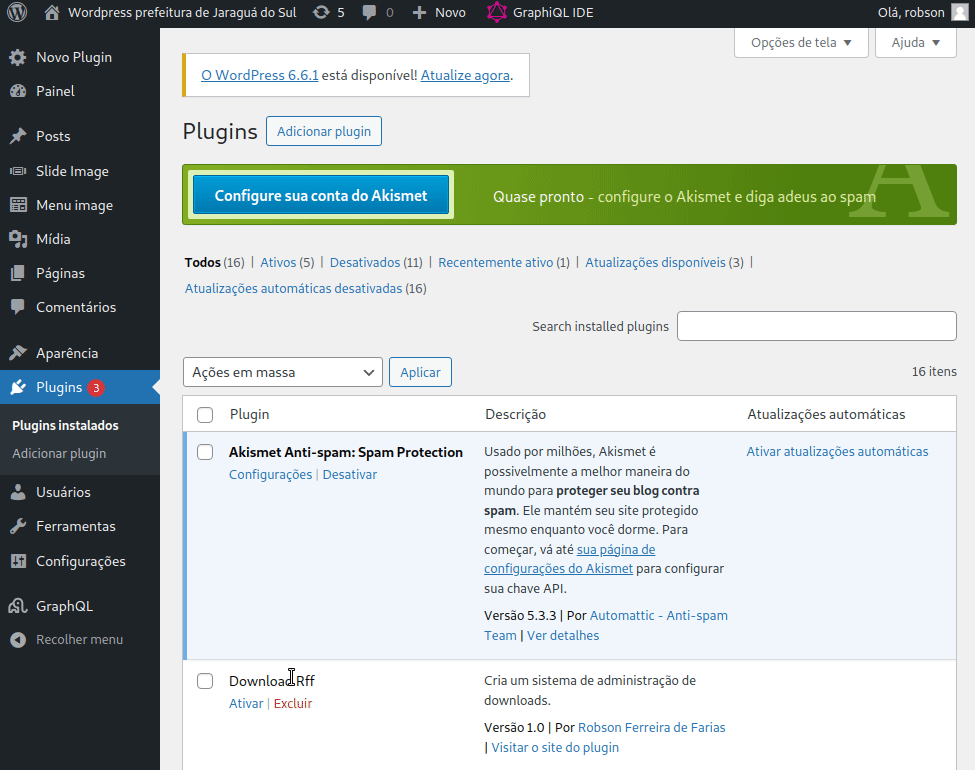
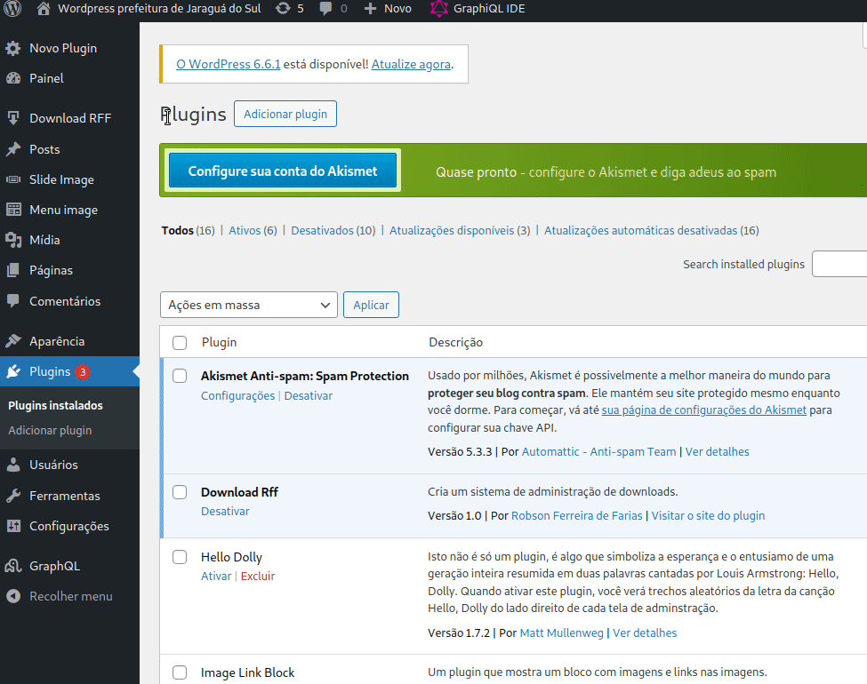
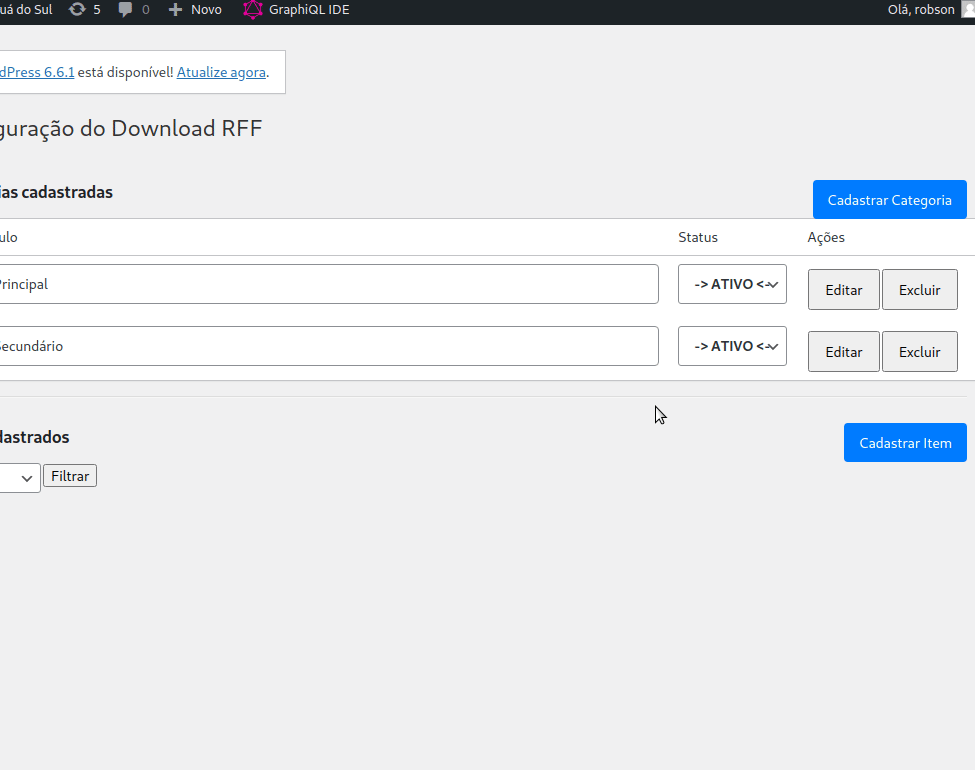
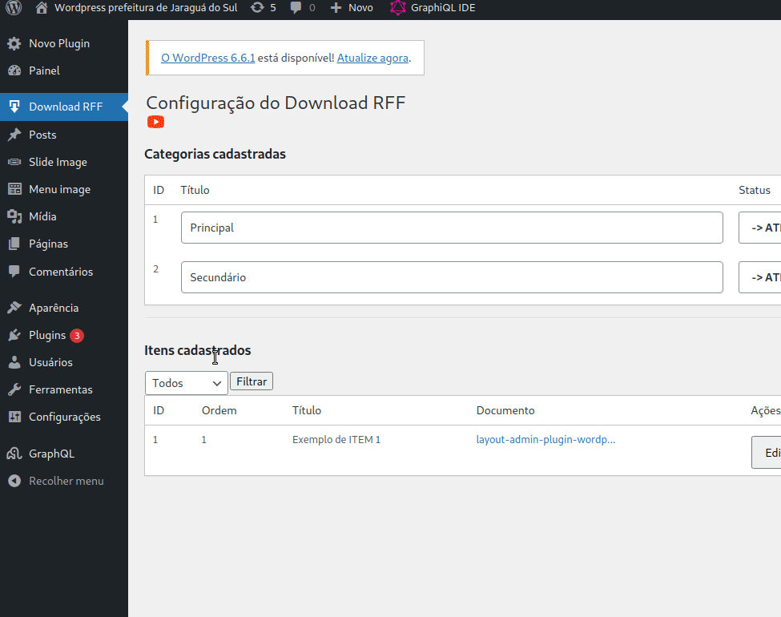
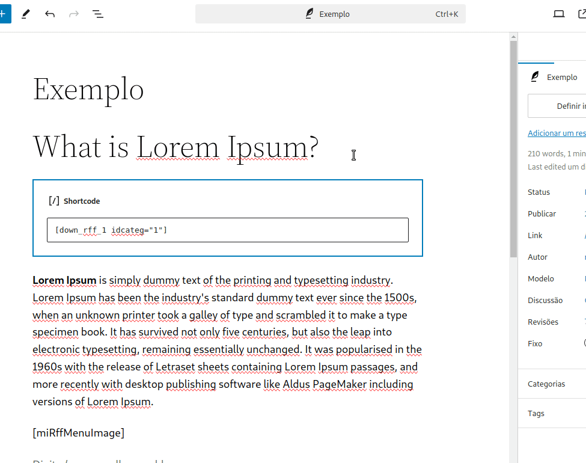

<!DOCTYPE html>
<html lang="en">
<head>
    <meta charset="UTF-8">
    <meta name="viewport" content="width=device-width, initial-scale=1.0">
    <title>Document</title>
</head>
<body>
    <h1>Download Rff</h1>
    <h2>Gerenciamento de arquivos para dowload</h2>
    <h4>Obs: depois de inserir o plugin e ativá-lo, dê a permissão de escrita e leitura na pasta downloads.</h4>
    <strong>Ativar o plugin e localização do botão de administração</strong>
     
    
     
     
    <strong>Cadastrar categoria</strong>
     
    
     
     
    <strong>Cadastrar item</strong>
     
    
     
     
    <strong>Acessando as tabelas via GraphQl</strong>
     
    
     
     
    <strong>Inserindo o shortcode no post</strong>
     
    
    <h2>Crédito</h2>
    Autor: Robson Ferreira de Farias 
    Linkedin: <a href="https://www.linkedin.com/in/robson-farias-a8b01723a/" target="_blank">Linkedin do Robson Farias</a>
</body>
</html>